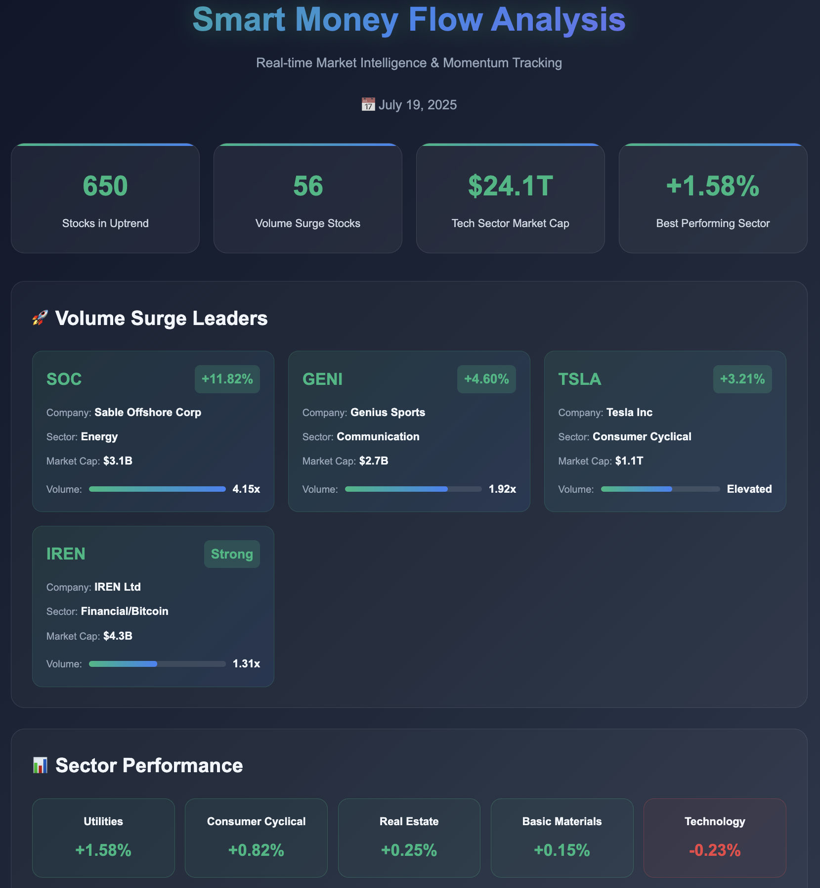
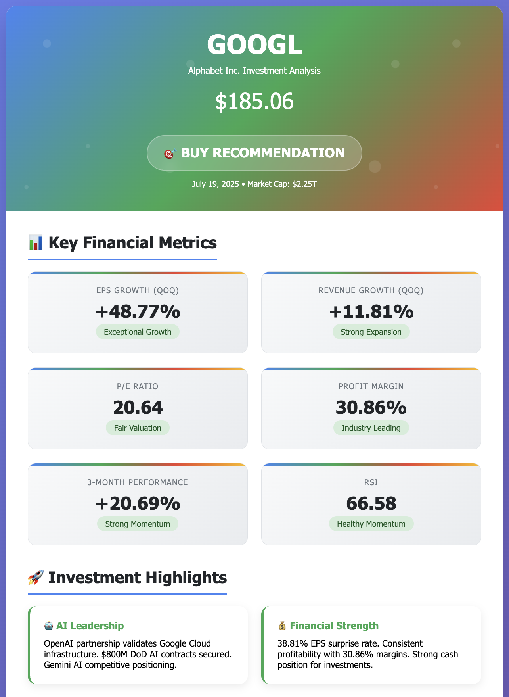

# How I Automated Stock Screening with AI and Finviz: A Game-Changer for Traders

**Published:** January 19, 2025  
**Author:** TraderMonty | *10 years trading US stocks*  
**Reading Time:** 8 minutes

## Save Hours on Stock Screening While Finding Better Trading Opportunities

If you're like me, you've probably found yourself spending way too many hours staring at stock screeners, tweaking filters, and hunting for that perfect trade setup. Well, I've got some good news that might just change how you approach your trading and investing.

Recently, I've been diving deep into AI tools—not just for work, but for everything. Heck, I even use AI to help plan my Lhasa Apso's grooming schedule these days. And that got me thinking: why not leverage this technology for something I spend a ton of time on anyway—stock screening?

**What you'll discover in this guide:**
- How to connect AI with Finviz for automated screening
- Real examples of AI-powered stock analysis that save hours
- Complete setup walkthrough with code examples
- The future of AI-assisted trading

## 📋 Table of Contents

- [The Problem Every Trader Faces](#the-problem-every-trader-faces)
- [What Happens When AI Meets Stock Screening?](#what-happens-when-ai-meets-stock-screening)
- [How I Built the Solution](#how-i-built-the-solution)
  - [What's an MCP Server?](#whats-an-mcp-server)
- [Real Results from Real Trading Sessions](#real-results-from-real-trading-sessions)
  - [Weekly Earnings Analysis](#weekly-earnings-analysis)
  - [Trend and Money Flow Analysis](#trend-and-money-flow-analysis)
  - [Real-Time News Analysis](#real-time-news-analysis)
- [Step-by-Step Setup Guide](#step-by-step-setup-guide)
  - [Prerequisites](#prerequisites)
  - [Quick Setup (5 minutes)](#quick-setup-5-minutes)
- [What's Next for AI-Powered Trading?](#whats-next-for-ai-powered-trading)
- [The Bottom Line](#the-bottom-line)

## The Problem Every Trader Faces

Let's be honest here. If you're serious about trading, you know the drill:

- Wake up early (or stay up late for pre-market)
- Fire up Finviz or your screener of choice
- Manually adjust dozens of filters
- Scan through hundreds of tickers
- Cross-reference with news and earnings
- Rinse and repeat

I've been a [Finviz® Elite](https://finviz.com/elite?affilId=279192576) subscriber for years, and while it's an incredible tool, I kept thinking there had to be a better way. That's when I decided to connect my favorite screening platform with AI.

## What Happens When AI Meets Stock Screening?

Picture this: Instead of clicking through multiple dropdowns and filters, you just tell AI what you want in plain English:

> *"Hey, find me stocks that beat earnings last week and are showing strong momentum"*

Or maybe:

> *"Show me dividend growers trading at reasonable valuations with positive analyst sentiment"*

The AI handles all the technical filtering and presents you with a clean, organized report. No more manual grunt work—just pure analysis and decision-making.

## How I Built the Solution

Here's where my background comes in handy. I spent years as a software engineering PM, but like many of us, I drifted away from hands-on coding as I moved up the ladder. Recently, with the "Vibe Coding" movement (where developers code alongside AI for fun and productivity), I decided to dust off my programming skills.

### What's an MCP Server?

With Claude as my coding partner, I built an **MCP (Model Context Protocol) server**.

**In simple terms:** MCP is like a universal adapter that lets AI assistants communicate with any application—in this case, Finviz®.

Think of it this way: Remember when USB became the standard for connecting devices? Before that, every printer needed its own special cable. MCP does the same thing for AI—it creates a standard way for AI to talk to different tools.

For the technical folks, here's what happens under the hood:

```
User Query → AI → MCP Server → Finviz API → Formatted Results
```

Anthropic has excellent documentation on this: [Model Context Protocol Guide](https://modelcontextprotocol.io/quickstart/server)

## Real Results from Real Trading Sessions

Let me show you what this looks like in action. These aren't mockups—this is exactly how I screen stocks now, every single day.

### Weekly Earnings Analysis

**My prompt:** *"Find me stocks that beat earnings last week and are showing strong momentum"*

**What the AI delivered:**
- Multi-step analysis combining earnings_winners_screener and fundamentals data
- Financial sector dominated with 100% representation among top performers
- Average weekly performance of +7.3% and EPS surprise of +7.8%
- Professional methodology with clear screening criteria and BUY ratings


*AI systematically searches for earnings winners using multiple screening tools and fundamental analysis*


*Professional report highlighting Financial sector dominance: IBKR with +9.3% weekly gain and +8.2% EPS surprise*

**Time saved:** What normally takes me 45 minutes of manual screening now takes 30 seconds.

### Trend and Money Flow Analysis

**My prompt:** *"Show me where the smart money is flowing—specifically, highlight stocks in strong uptrends with rising volume, as well as sectors and industries showing clear momentum."*

**What the AI found:**
- 650 stocks in confirmed technical uptrends with broad market strength
- 56 stocks with significant volume surges (1.5x+ normal volume)
- Clear sector rotation: Utilities (+1.58%) and Consumer Cyclical (+0.82%) leading
- Technology maintaining dominance with $24T market cap despite consolidation


*AI identifies volume surge leaders: SOC (+11.82%), GENI (+4.60%), TSLA (+3.21%), and sector performance*


*Detailed market intelligence report showing 650 uptrend stocks and sector rotation dynamics*

**Key insight:** The AI identified a broad-based market strength with energy sector breakouts and defensive rotation into utilities.

### Real-Time News Analysis

**My prompt:** *"Analyze GOOGL's recent news and tell me if it's a buy, hold, or sell"*

**The AI's comprehensive analysis included:**
- Strong analyst sentiment: KeyBanc raised target to $215, BMO maintained "Outperform"
- Exceptional financial performance: +48.77% EPS growth, +11.81% revenue growth
- Strategic AI positioning: OpenAI partnership, $800M DoD contracts, Bard/Gemini competition
- Clear BUY recommendation with detailed fundamental and strategic analysis


*AI systematically analyzes news, fundamentals, and SEC filings to generate investment recommendation*


*Professional investment report with BUY rating, price target $220-240, and comprehensive analysis*

**Result:** The AI provided a clear BUY recommendation with detailed reasoning, highlighting strong fundamentals and AI market positioning.

## Step-by-Step Setup Guide

⚠️ **Quick Reminder:** This tool is for analysis and education—not financial advice.

I've open-sourced the entire project: [finviz-mcp-server on GitHub](https://github.com/tradermonty/finviz-mcp-server)

### Prerequisites

- Python 3.11 or higher (tested and recommended)
- Finviz® Elite subscription (for full features)
- Claude Desktop or compatible AI assistant

### Quick Setup (5 minutes)

**1. Clone the repository:**
```bash
git clone https://github.com/tradermonty/finviz-mcp-server.git
cd finviz-mcp-server
```

**2. Create virtual environment:**
```bash
python -m venv venv

# Activate the environment:
# macOS/Linux:
source venv/bin/activate

# Windows Command Prompt:
venv\Scripts\activate

# Windows PowerShell:
.\venv\Scripts\Activate.ps1
```

**3. Install dependencies:**
```bash
pip install -r requirements.txt
```

**4. Configure Claude Desktop:**

Add to your `claude_desktop_config.json`:

```json
{
  "mcpServers": {
    "finviz": {
      "command": "python",
      "args": ["-m", "finviz_mcp_server"],
      "cwd": "/full/path/to/finviz-mcp-server"
    }
  }
}
```

**Path examples:**
- **macOS/Linux:** `"/Users/yourname/finviz-mcp-server"`
- **Windows:** `"C:\\Users\\yourname\\finviz-mcp-server"`
- **Relative paths:** Use absolute paths for reliability

**5. Test it out:**

Ask Claude: "Find me the top 5 dividend stocks under $50"

**Pro tip:** Start simple. Master basic queries before trying complex multi-factor screens.

## What's Next for AI-Powered Trading?

Right now, the tool focuses on screening and analysis, but I'm already working on:

- **Automated trade execution** (with proper safeguards, of course)
- **Portfolio rebalancing suggestions** based on market conditions
- **Correlation analysis** between news events and price movements
- **Custom alert systems** that understand context, not just price levels

## The Bottom Line

We're at an inflection point. AI isn't just a buzzword anymore—it's a practical tool that gives individual traders capabilities that were once exclusive to hedge funds.

**What this means for you:**

✓ **Save 5+ hours per week** on manual screening  
✓ **Spot opportunities faster** with AI pattern recognition  
✓ **Remove emotional bias** from your analysis  
✓ **Scale your research** across thousands of stocks

The combination of Finviz®'s data and AI's analytical power is genuinely game-changing.

## Ready to Get Started?

1. **[Get the code](https://github.com/tradermonty/finviz-mcp-server)** - Star the repo if it helps you!
2. **Share your results** - Tag me @monty_investor with your wins

---

## About the Author

**TraderMonty** is a former software engineering PM who's been trading US stocks for 10 years. After years in tech leadership, he recently jumped back into hands-on coding thanks to the Vibe Coding movement. Based in California, he combines his PM experience, renewed coding passion, and deep market knowledge to build tools that make trading more efficient. When not analyzing charts or coding with AI, you'll find him hiking with his Lhasa Apso or working on his latest trading automation project.

*Questions? Ideas? Connect on [X @monty_investor](https://x.com/monty_investor)*

---

**Legal Notice:** This content is for educational purposes only. Trading involves substantial risk of loss. Past performance doesn't guarantee future results. Always do your own research. Finviz® is a registered trademark of Finviz Inc. Anthropic® and Claude® are trademarks of Anthropic, PBC. This project is not affiliated with or endorsed by these companies.